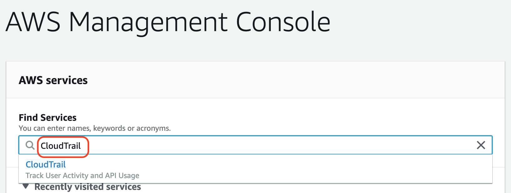
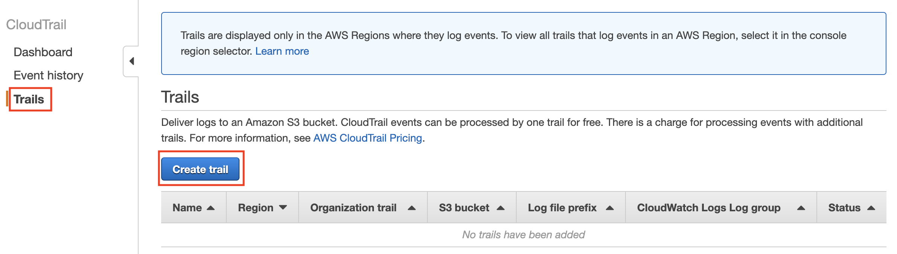
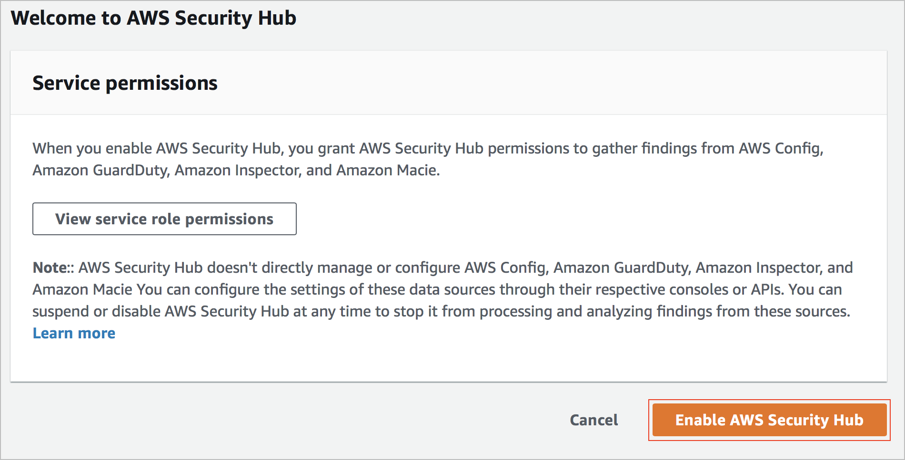
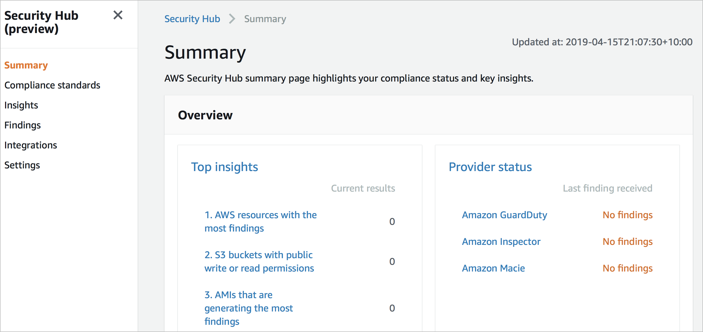

# Level 100: Enable CloudTrail via AWS Console

## Authors
- Louay Shaat,  Solutions Architect

## Table of Contents
1. [Getting Started](#getting_Started)

## 1. Getting Started 
The AWS console provides a graphical user interface to search and work with the AWS services.
We will use the AWS console to enable Cloud Trail.

### 1.1 CloudTrail
Once you have logged into your AWS account you can use the search facility to locate Cloud Trail.
All you need to do is type in *CloudTrail* in the search field.
Once CloudTrail shows up you can click on **CloudTrail** to go to the CloudTrail service.
 

Alternatively you can go directly to the AWS Security Hub Console.
[AWS Security Hub Console](https://console.aws.amazon.com/securityhub/)

### 1.2 Enable Cloud Trail in your selected region  

In the *CloudTrail* service console you can click on  **trails** to create a CloudTrail in your account.
 

AWS Security Hub requires *services permissions* to run within your account.
You can review the service role permissions in the following screen. Remember to click **Enable AWS Security Hub**

### 1.3 Explore AWS Security Hub
With AWS Security Hub now enabled in your account, you can explore the security insights AWS Security Hub offers.

## References & useful resources:
[AWS Security Hub](https://aws.amazon.com/security-hub/)  

## License
Licensed under the Apache 2.0 and MITnoAttr License. 

Copyright 2019 Amazon.com, Inc. or its affiliates. All Rights Reserved.

Licensed under the Apache License, Version 2.0 (the "License"). You may not use this file except in compliance with the License. A copy of the License is located at

    http://aws.amazon.com/apache2.0/

or in the "license" file accompanying this file. This file is distributed on an "AS IS" BASIS, WITHOUT WARRANTIES OR CONDITIONS OF ANY KIND, either express or implied. See the License for the specific language governing permissions and limitations under the License.
