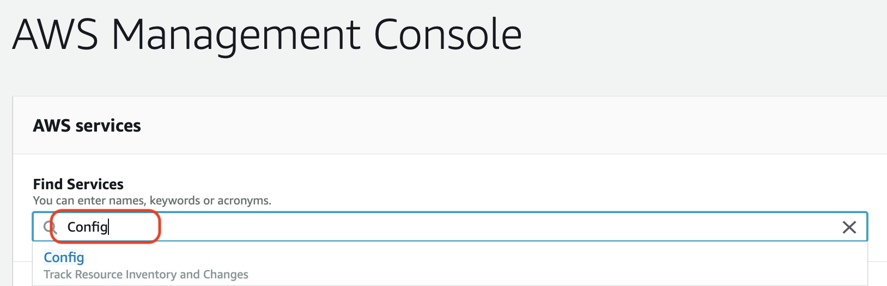
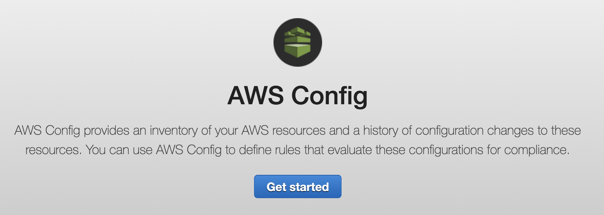
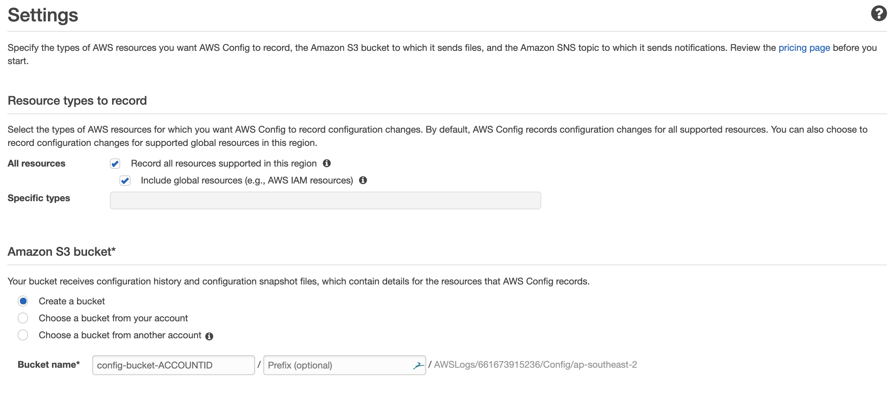

# Level 100: Enable Config via AWS Console

## Authors
- Louay Shaat,  Solutions Architect

## Table of Contents
1. [Getting Started](#getting_Started)

## 1. Getting Started 
The AWS console provides a graphical user interface to search and work with the AWS services.
We will use the AWS console to enable Cloud Trail.

### 1.1 Config
Once you have logged into your AWS account you can use the search facility to locate Cloud Trail.
All you need to do is type in *Config* in the search field.
Once Config shows up you can click on **Config** to go to the Config service.
 

### 1.2 Enable Config in your selected region  

In the *Config* service console you can click on the **Get Started Now** orange button to enable AWS Security Hub in your account.
 

**Config is created in the region selected, ensure you are in the correct region.**

* On the Settings page, for Resource types to record, under All resources
* Select Record all resources supported in this region
* Select Include global resources
* For Amazon S3 Bucket, 
    * select Create a new bucket – choose the bucket name already filled for you
* Amazon SNS topic - leave unselected
* AWS Config role
    * Select *Create AWS Config service-linked role*
    
 

On AWS Config rules page select SKIP
AWS Config displays the Resource inventory page. AWS config is now configured.

## References & useful resources:
[AWS Config](https://aws.amazon.com/config)  

## License
Licensed under the Apache 2.0 and MITnoAttr License. 

Copyright 2019 Amazon.com, Inc. or its affiliates. All Rights Reserved.

Licensed under the Apache License, Version 2.0 (the "License"). You may not use this file except in compliance with the License. A copy of the License is located at

    http://aws.amazon.com/apache2.0/

or in the "license" file accompanying this file. This file is distributed on an "AS IS" BASIS, WITHOUT WARRANTIES OR CONDITIONS OF ANY KIND, either express or implied. See the License for the specific language governing permissions and limitations under the License.
