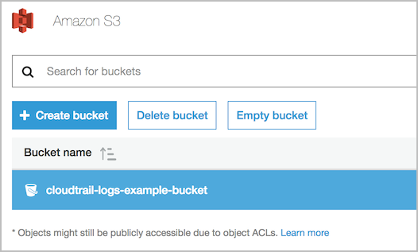
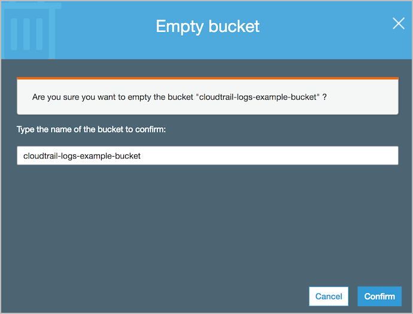
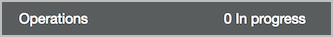
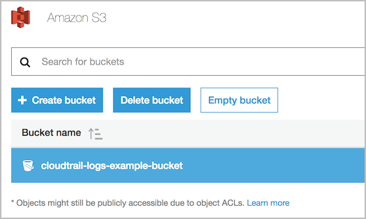
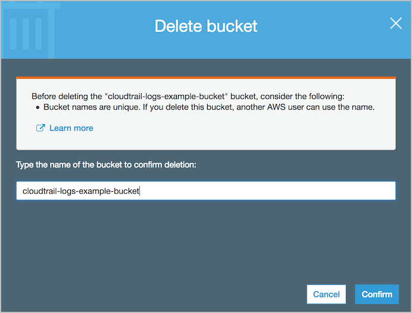

# Level 200: Automated Cloud Trail: Lab Guide

## Authors
- Louay Shaat, Solutions Architect


## 1. Create an Simple Notification Service Topic for alerting
Once you have logged into your AWS account, navigate bto the SNS service.
All you need to do is type in *SNS* in the search field.
Once Simple Notification Service shows up you can click on **Topics** to go to the Topics Sub Menu.
 

Click on Create topic and select a Topic Name
 

Once topic is created, select ARN of topic which will open Topic details page
On Topic details page select Create Subscription
 

Select protocol Email and provide your email address for notification
Finish by selecting Create Subscription
 
You will receive an email for subscription confirmation on your email, Confirm Subscription using the link received in email
Check SNS topic to confirm subscription verification. It should show ARN for subscriber ID
 


## 2. Create IAM policy for lambda function to turn ON CloudTrail
Open the AWS Config console at IAM Console
Select Policy from left panel of IAM console and then select Create Policy
Select JSON. Delete the default policy and replace with the link below.

```
{
    "Version": "2012-10-17",
    "Statement": [
        {
            "Sid": "LambdaCloudtraiMonitor",
            "Effect": "Allow",
            "Action": [
                "cloudtrail:DescribeTrails",
                "cloudtrail:GetTrailStatus",
                "cloudtrail:StartLogging"
            ],
            "Resource": [
                "arn:aws:cloudtrail:*:<AWS-ACCOUNT-ID>:trail/*"
            ]
        },
        {
            "Sid": "CloudWacthLogspermissions",
            "Effect": "Allow",
            "Action": [
                "logs:CreateLogGroup",
                "logs:CreateLogStream",
                "logs:PutLogEvents"
            ],
            "Resource": [
                "arn:aws:logs:*:*:*"
            ]
        },
        {
            "Sid": "SNSPublishpermissions",
            "Effect": "Allow",
            "Action": [
                "sns:Publish"
            ],
            "Resource": [
                "arn:aws:sns:*:*:*"
            ]
        }
    ]
}
```


### 3. Tear down this lab <a name="tear_down"></a>
The following instructions will remove the resources that have a cost for running them.

Note: If you are planning on doing the lab [300_Incident_Response_with_AWS_Console_and_CLI](Security/300_Incident_Response_with_AWS_Console_and_CLI/Lab_Guide.md) we recommend you only tear down this stack after completing that lab as their is a dependency on AWS CloudTrail being enabled for the other lab.

Delete the stack:
1. Sign in to the AWS Management Console, and open the CloudFormation console at https://console.aws.amazon.com/cloudformation/.
2. Select the `DetectiveControls` stack.
3. Click the Actions button then click Delete Stack.
4. Confirm the stack and then click the Yes, Delete button.

Empty and delete the S3 buckets:
1. Sign in to the AWS Management Console, and open the S3 console at https://console.aws.amazon.com/s3/.
2. Select the CloudTrail bucket name you previously created without clicking the name.
  
3. Click Empty bucket and enter the bucket name in the confirmation box.  
  
4. Click Confirm and the bucket will be emptied when the bottom task bar has 0 operations in progress.  
  
5. With the bucket now empty, click Delete bucket.

6. Enter the bucket name in the confirmation box and click Confirm.
  
7. Repeat steps 2 to 6 for the Config bucket you created.


***

## References & useful resources:
[AWS CloudTrail User Guide](https://docs.aws.amazon.com/awscloudtrail/latest/userguide/cloudtrail-user-guide.html)  
[AWS CloudFormation User Guide](https://docs.aws.amazon.com/AWSCloudFormation/latest/UserGuide/Welcome.html)  
[Amazon GuardDuty User Guide](https://docs.aws.amazon.com/guardduty/latest/ug/what-is-guardduty.html)  
[AWS Config User Guide](https://docs.aws.amazon.com/config/latest/)  


***

## License
Licensed under the Apache 2.0 and MITnoAttr License. 

Copyright 2019 Amazon.com, Inc. or its affiliates. All Rights Reserved.

Licensed under the Apache License, Version 2.0 (the "License"). You may not use this file except in compliance with the License. A copy of the License is located at

    http://aws.amazon.com/apache2.0/

or in the "license" file accompanying this file. This file is distributed on an "AS IS" BASIS, WITHOUT WARRANTIES OR CONDITIONS OF ANY KIND, either express or implied. See the License for the specific language governing permissions and limitations under the License.
