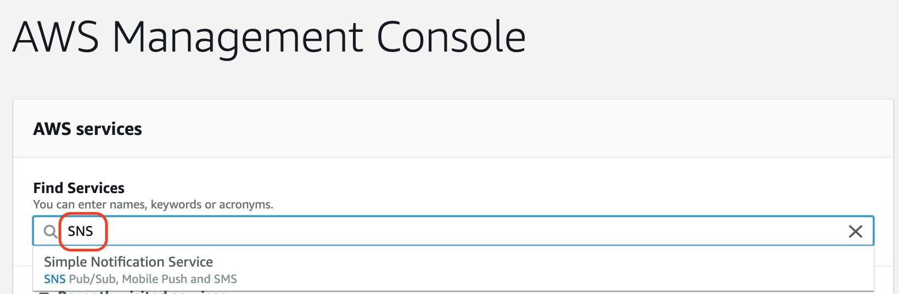
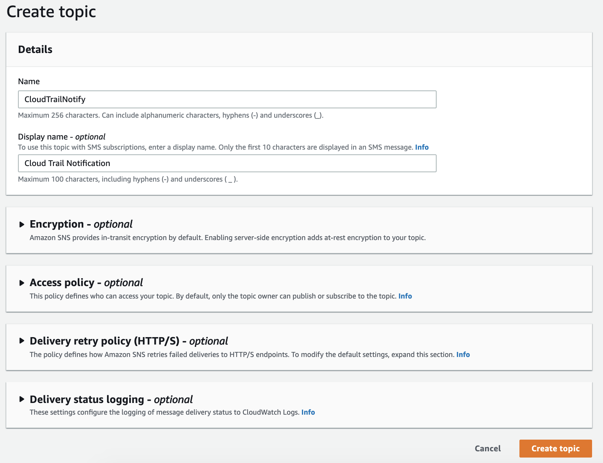
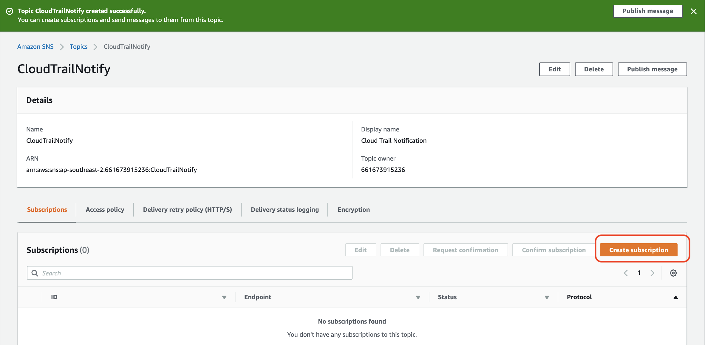
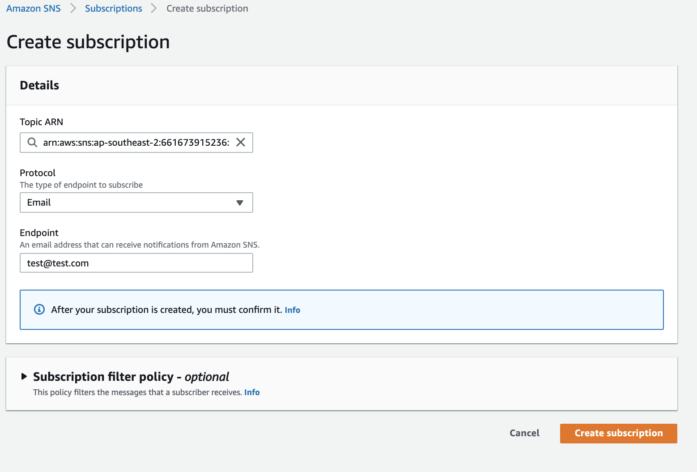
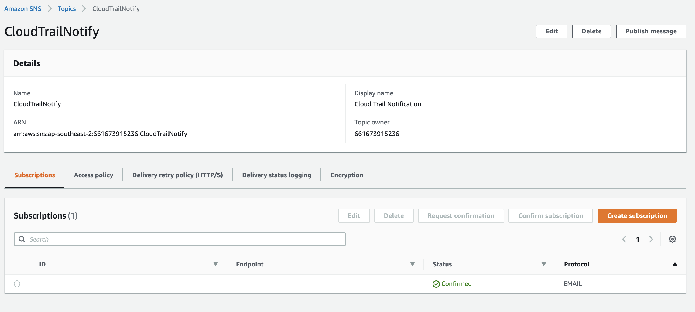
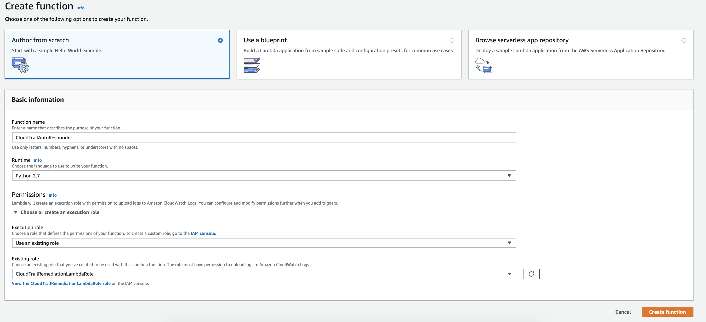
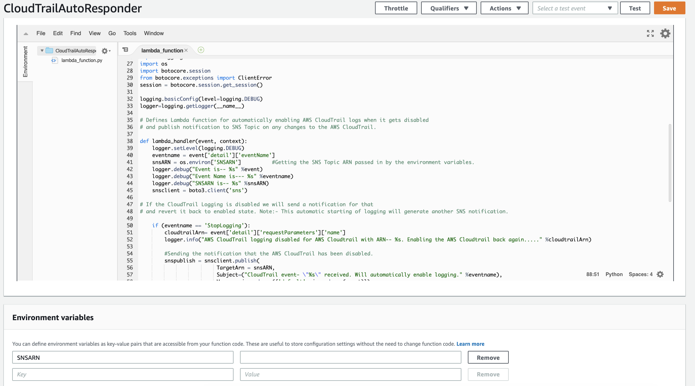
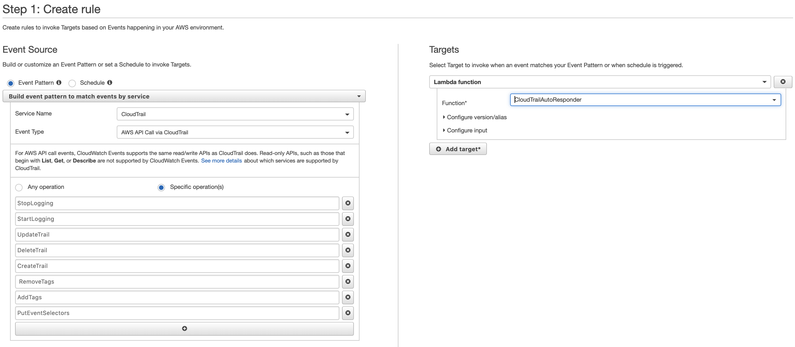

# Level 200: Automated Cloud Trail: Lab Guide

## Authors
- Louay Shaat, Solutions Architect


## 1. Create an Simple Notification Service Topic for alerting
Once you have logged into your AWS account, navigate bto the SNS service.
All you need to do is type in *SNS* in the search field.
Once Simple Notification Service shows up you can click on **Topics** to go to the Topics Sub Menu.

 

Click on Create topic and select a Topic Name

 

Once topic is created, select ARN of topic which will open Topic details page
On Topic details page select Create Subscription

 

Select protocol Email and provide your email address for notification
Finish by selecting Create Subscription

 

You will receive an email for subscription confirmation on your email, Confirm Subscription using the link received in email
Check SNS topic to confirm subscription verification. It should show ARN for subscriber ID

 


## 2. Create IAM policy for lambda function to turn ON CloudTrail
Open the AWS Config console at IAM Console
Select Policy from left panel of IAM console and then select Create Policy
Select JSON. Delete the default policy and replace with the link below.

*Please ensure that you replace **AWS-ACCOUNT_ID** with your account ID*
```
{
    "Version": "2012-10-17",
    "Statement": [
        {
            "Sid": "LambdaCloudtraiMonitor",
            "Effect": "Allow",
            "Action": [
                "cloudtrail:DescribeTrails",
                "cloudtrail:GetTrailStatus",
                "cloudtrail:StartLogging"
            ],
            "Resource": [
                "arn:aws:cloudtrail:*:<AWS-ACCOUNT-ID>:trail/*"
            ]
        },
        {
            "Sid": "CloudWacthLogspermissions",
            "Effect": "Allow",
            "Action": [
                "logs:CreateLogGroup",
                "logs:CreateLogStream",
                "logs:PutLogEvents"
            ],
            "Resource": [
                "arn:aws:logs:*:*:*"
            ]
        },
        {
            "Sid": "SNSPublishpermissions",
            "Effect": "Allow",
            "Action": [
                "sns:Publish"
            ],
            "Resource": [
                "arn:aws:sns:*:*:*"
            ]
        }
    ]
}
```
Click Review Policy
Provide Policy name as *cloudtrail-remediation-lambda*
Click Create Policy


### 3. Create IAM role for your Lambda function
On AWS IAM console, select Role from left panel
Select Create Role
* Select Lambda from the list of services that will use this role and then select Next: Permission
* In search box provide the policy name we created previously *cloudtrail-remediation-lambda*
* Select the check box next to the policy you created previously, *cloudtrail-remediation-lambda* and select Next: Review
* Name your role *CloudTrailRemediationLambdaRole* and provide a description
Select Create Role


### 4. Create Lambda function
In the AWS Management Console, under Services, select Lambda to go to the Lambda Console
From the Dashboard, select Create Function button in the upper-right
On the Create function page: Choose Author from scratch
Provide a name for the function. We’re using CloudTrailAutoResponder
In the Runtime dropdown list, select Python 2.7 as our lambda function in in python
Under Role, select Choose an existing role. Select the role CloudTrailRemediationLambdaRole and Create function

 

Scroll down to the Designer section and select the name of your Lambda function and replace the code below

```
# Copyright 2016 Amazon.com, Inc. or its affiliates. All Rights Reserved.
#
# Licensed under the Apache License, Version 2.0 (the "License").
# You may not use this file except in compliance with the License.
# A copy of the License is located at
#
#     http://aws.amazon.com/apache2.0/
#
# or in the "license" file accompanying this file.
# This file is distributed on an "AS IS" BASIS, WITHOUT WARRANTIES OR CONDITIONS OF ANY KIND,
# either express or implied. See the License for the specific language governing permissions
# and limitations under the License.
#
# Description: Lambda function that sends notification on AWS CloudTrail changes and when a trail gets disabled it re-enables it back.
#
# Cloudtraillambdamonitor.py
#
# Author: Louay Shaat, shaaloua@amazon.com
# Date: 2017-06-08
#
#
import json
import time
import boto3
import logging
import os
import botocore.session
from botocore.exceptions import ClientError
session = botocore.session.get_session()
logging.basicConfig(level=logging.DEBUG)
logger=logging.getLogger(__name__)
# Defines Lambda function for automatically enabling AWS CloudTrail logs when it gets disabled 
# and publish notification to SNS Topic on any changes to the AWS CloudTrail.
def lambda_handler(event, context):
    logger.setLevel(logging.DEBUG)
    eventname = event['detail']['eventName']
    snsARN = os.environ['SNSARN']          #Getting the SNS Topic ARN passed in by the environment variables.
    logger.debug("Event is-- %s" %event)
    logger.debug("Event Name is--- %s" %eventname)
    logger.debug("SNSARN is-- %s" %snsARN) 
    snsclient = boto3.client('sns')  
# If the CloudTrail Logging is disabled we will send a notification for that 
# and revert it back to enabled state. Note:- This automatic starting of logging will generate another SNS notification. 
    if (eventname == 'StopLogging'):
        cloudtrailArn= event['detail']['requestParameters']['name']
        logger.info("AWS CloudTrail logging disabled for AWS Cloudtrail with ARN-- %s. Enabling the AWS Cloudtrail back again....." %cloudtrailArn)
        #Sending the notification that the AWS CloudTrail has been disabled.
        snspublish = snsclient.publish(
                         TargetArn = snsARN,
                         Subject=("CloudTrail event- \"%s\" received. Will automatically enable logging." %eventname),
                         Message=json.dumps({'default': json.dumps(event)}),
                         MessageStructure='json')
       #Enabling the AWS CloudTrail logging     
        try:
            client = boto3.client('cloudtrail')
            enablelogging = client.start_logging(Name=cloudtrailArn)
            logger.debug("Response on enable CloudTrail logging- %s" %enablelogging)
        except ClientError as e:
           logger.error("An error occured: %s" %e)
# Anything other than "StopLogging" event such as update, add/remove tags, create new trail etc.
# just a notification is sent to the Amazon SNS topic subscribers. 
    else:
        logger.info("The CloudTrail event was %s, sending email to the SNS topic subscribed" %eventname)
        try:    
            #Sending the notification that a change has been made in AWS CloudTrail other than disabling it.
            snspublish = snsclient.publish(
                         TargetArn= snsARN,
                         Subject=("CloudTrail event- \"%s\" received" %eventname),
                         Message=json.dumps({'default': json.dumps(event)}),
                         MessageStructure='json')
            logger.debug("SNS Publish Response- %s" %snspublish)
        except ClientError as e:
           logger.error("An error occured: %s" %e)
```

Configure environment variable as below
Key: SNSARN
Value: The SNS topic ARN we created earlier in Step-1



Save function by Selecting Save on top of the page

### 5. Create and Configure a CloudWatch Rule to detect event and trigger remediation
In the AWS Management Console, under Services, select CloudWatch

* On the left-hand side, under Events, select Rules
* Click Create rule and provide following details
    * Build Pattern to Match - Event By Service
    * Service Name: CloudTrail
    * Event Type: AWS API call via CloudTrail
    * Specific Operations: StopLogging, StartLogging, UpdateTrail, DeleteTrail, CreateTrail, RemoveTags, AddTags, PutEventSelectors. 
    
    Note: Please put each of this parameter in separate row. Post this configuration your event pattern should look like as below

```
{
  "source": [
    "aws.cloudtrail"
  ],
  "detail-type": [
    "AWS API Call via CloudTrail"
  ],
  "detail": {
    "eventSource": [
      "cloudtrail.amazonaws.com"
    ],
    "eventName": [
      "StopLogging",
      "StartLogging",
      "UpdateTrail",
      "DeleteTrail",
      "CreateTrail",
      "RemoveTags",
      "AddTags",
      "PutEventSelectors"
    ]
  }
}
```
Add trigger for remediation by selecting Add Target
Select Lambda Function from drop down
For Function select name of the lambda function you created earlier *CloudTrailAutoResponder*
Give your rule a name and description.
Select Create Rule
Verify that rule has been created



### 6. Verify it works

In the AWS Management Console, under Services, select CloudTrail

* Select Trail from left pane
* Select the trail name - ensure that trail is in same region in which have you created this lab resources
* Turn off the trail
I
n a few minutes, In the Console, we can see that the trail is turned back on. This is done by invocation of the Lambda function triggered by the CloudWatch Rule created earlier which has detected the StopLogging event and executed Lambda function for remediation. You will also receive an email notification for this event

## References & useful resources:
[AWS Lambda](https://docs.aws.amazon.com/lambda/latest/dg/welcome.html)  
[AWS CloudWatch Rules](https://docs.aws.amazon.com/AmazonCloudWatch/latest/events/Create-CloudWatch-Events-Rule.html)  
[Amazon SNS](https://docs.aws.amazon.com/sns/)   


## License
Licensed under the Apache 2.0 and MITnoAttr License. 

Copyright 2019 Amazon.com, Inc. or its affiliates. All Rights Reserved.

Licensed under the Apache License, Version 2.0 (the "License"). You may not use this file except in compliance with the License. A copy of the License is located at

    http://aws.amazon.com/apache2.0/

or in the "license" file accompanying this file. This file is distributed on an "AS IS" BASIS, WITHOUT WARRANTIES OR CONDITIONS OF ANY KIND, either express or implied. See the License for the specific language governing permissions and limitations under the License.
